# ElitorcAI - TiDB AgentX Hackathon

## Multi-Step Agentic Clinical AI System

ElitorcAI is an advanced multimodal clinical AI assistant that demonstrates real-world agentic workflows using TiDB Serverless for vector search and clinical case analysis. Built for the TiDB AgentX Hackathon, this system showcases multi-step AI agents that go beyond simple RAG to deliver comprehensive clinical decision support.

**Multi-Step Agentic Workflow:**

```mermaid
flowchart TD
    A[📋 Patient Input<br/>Medical Images + Symptoms] --> B[🔍 Step 1: Medical Image Analysis<br/>Roboflow AI Detection]
    B --> C[🧠 Step 2: Embedding Generation<br/>Cohere Text Embeddings]
    C --> D[🔎 Step 3: Vector Search<br/>TiDB Similarity Search]
    D --> E[⚕️ Step 4: Clinical Reasoning<br/>Groq LLM Synthesis]
    
    F[(🗄️ TiDB Serverless<br/>Vector Database)] -.-> D
    G[📊 MultiCaRe Dataset<br/>200+ Clinical Cases] -.-> F
    
    E --> H[📄 Structured Clinical Report<br/>• Primary Diagnosis<br/>• Similar Cases<br/>• Treatment Plan]
    
    style A fill:#f9f9f9,stroke:#333,stroke-width:2px,color:#000
    style B fill:#f9f9f9,stroke:#333,stroke-width:2px,color:#000
    style C fill:#f9f9f9,stroke:#333,stroke-width:2px,color:#000
    style D fill:#f9f9f9,stroke:#333,stroke-width:2px,color:#000
    style E fill:#f9f9f9,stroke:#333,stroke-width:2px,color:#000
    style F fill:#e6e6e6,stroke:#333,stroke-width:2px,color:#000
    style G fill:#e6e6e6,stroke:#333,stroke-width:2px,color:#000
    style H fill:#f9f9f9,stroke:#333,stroke-width:2px,color:#000
```



### 🧠 Dr. AMIE - Clinical AI Agent

Dr. AMIE (Advanced Multimodal Intelligence for Emergency care) is a sophisticated clinical AI that:

- **Analyzes medical images** (X-rays, CT scans, MRI) using Roboflow integration
- **Searches clinical databases** for similar cases using TiDB vector search
- **Provides differential diagnoses** with confidence levels
- **Recommends diagnostic workups** and treatment plans
- **Ingests new cases** into the knowledge base for continuous learning

### 🔧 Technical Architecture

- **Frontend:** Next.js with Mastra framework
- **Backend:** Unified Mastra server with agent orchestration
- **Database:** TiDB Serverless with vector search capabilities
- **LLM:** Groq (Llama 3.3 70B)
- **Embeddings:** Cohere embed-english-v3.0
- **Image Analysis:** Roboflow API
- **Memory:** LibSQL with persistent storage

## 🚀 Quick Start

### Prerequisites
- Node.js 18+
- TiDB Serverless account
- API keys for Groq, Cohere, and Roboflow

### Installation

```bash
git clone https://github.com/N-45div/ElitOrc-AI
npm install
cp env.example .env
# Configure your API keys in .env
```

### Database Scripts

```bash
npm run seed              # Seed with sample clinical cases
npm run seed:multicare    # Seed with MultiCaRe dataset (with embeddings)
npm run test:tidb         # Test TiDB connection and functionality
npm run reset:tidb        # Reset TiDB tables
```

### Run the Application

```bash
# Start Mastra server (port 3001)
npx mastra dev

# In another terminal, start Next.js frontend (port 3000)
npm run dev
```

### Test the System

Visit `http://localhost:3001` for the Mastra playground or `http://localhost:3000` for the full chat interface.

**Example Queries:**
- "A 45-year-old male presents with chest pain, shortness of breath, and fatigue for the past 3 days. He has a history of hypertension and smoking. What should I consider?"
- "Analyze this MRI scan for a patient with lower back pain"
- "Find similar cases for a 67-year-old female with COPD and pneumonia"

## 🏗️ Multi-Step Workflow

1. **Patient Query Input** → Clinical symptoms, medical history, images
2. **TiDB Vector Search** → Find similar historical cases using embeddings
3. **Image Analysis** → Roboflow API processes medical images
4. **LLM Clinical Reasoning** → Groq analyzes all data for diagnosis
5. **Case Documentation** → Novel cases ingested back into TiDB
6. **Clinical Report** → Structured output with recommendations

## 📊 Data Flow

```
Patient Input → Embedding Generation → TiDB Vector Search → Similar Cases
     ↓                                                           ↓
Medical Images → Roboflow Analysis → Clinical Context → LLM Analysis
     ↓                                                           ↓
Structured Report ← Clinical Reasoning ← Combined Evidence ← Case History
```

## 🎯 Innovative Features

- **Real-World Impact**: Actual clinical decision support system
- **Multi-Step Agents**: Complex workflows beyond simple Q&A
- **TiDB Vector Search**: Leverages TiDB Serverless vector capabilities
- **Continuous Learning**: New cases automatically indexed
- **Multimodal Integration**: Text, images, and structured data

## 🔧 Technical Implementation

### Vector Database (TiDB Serverless)
- Clinical case storage with vector embeddings
- Cosine similarity search for case matching
- Scalable cloud-native architecture

### Agent Architecture
- Mastra framework for agent orchestration
- Tool-based architecture with composable functions
- Memory persistence with LibSQL

### API Integrations
- **Groq**: LLM inference with Llama 3.3 70B
- **Cohere**: High-quality medical text embeddings
- **Roboflow**: Medical image analysis and detection

### Data Processing Pipeline
- **Parquet File Support**: Process large medical datasets efficiently
- **Batch Processing**: Handle thousands of clinical cases with optimized memory usage
- **Embedding Generation**: Create semantic vectors for similarity search
- **Database Migration Scripts**: Seamless data import and management

## 🌟 Key Features

### Clinical Decision Support
- Multi-modal analysis (text + medical images)
- Evidence-based recommendations with confidence scores
- Similar case retrieval for complex presentations
- Risk stratification based on historical outcomes

### Radiology Support
- MRI/CT scan analysis with Roboflow integration
- Comparison with similar imaging findings
- Automated reporting with confidence scores

### Medical Education
- Case-based learning with similar patient scenarios
- Clinical reasoning development
- Evidence-based medicine integration

### Advanced Data Processing
- **MultiCaRe Dataset Integration**: Process large-scale medical case datasets from [Zenodo](https://zenodo.org/records/15814064)
- **Batch Embedding Generation**: Efficient processing with Cohere embeddings
- **Vector Database Seeding**: Populate TiDB with real clinical cases for similarity search

## 🔒 Privacy & Compliance

- No PHI stored in vector embeddings
- Anonymized clinical cases only
- HIPAA-compliant architecture ready
- Audit trails for all clinical decisions

## 📊 Dataset Attribution

This project utilizes the **MultiCaRe Dataset** for training and evaluation:

- **Dataset**: MultiCaRe - A Multi-Domain Dataset for Case Report Classification
- **Source**: [Zenodo Repository](https://zenodo.org/records/15814064)
- **GitHub**: [MultiCaRe Dataset Repository](https://github.com/mauro-nievoff/MultiCaRe_Dataset)
- **License**: Open source dataset for research purposes
- **Citation**: Nievoff, M., et al. (2024). MultiCaRe: A Multi-Domain Dataset for Case Report Classification

The dataset contains anonymized clinical case reports across multiple medical domains, enabling robust similarity search and clinical decision support capabilities.

## 📈 Future Roadmap

- Real-time clinical alerts and notifications
- Integration with EHR systems
- Mobile app for point-of-care use
- Federated learning across healthcare networks

---

**Built for TiDB AgentX Hackathon 2025** | **Team**: ElitorcAI | **License**: MIT
